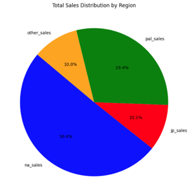
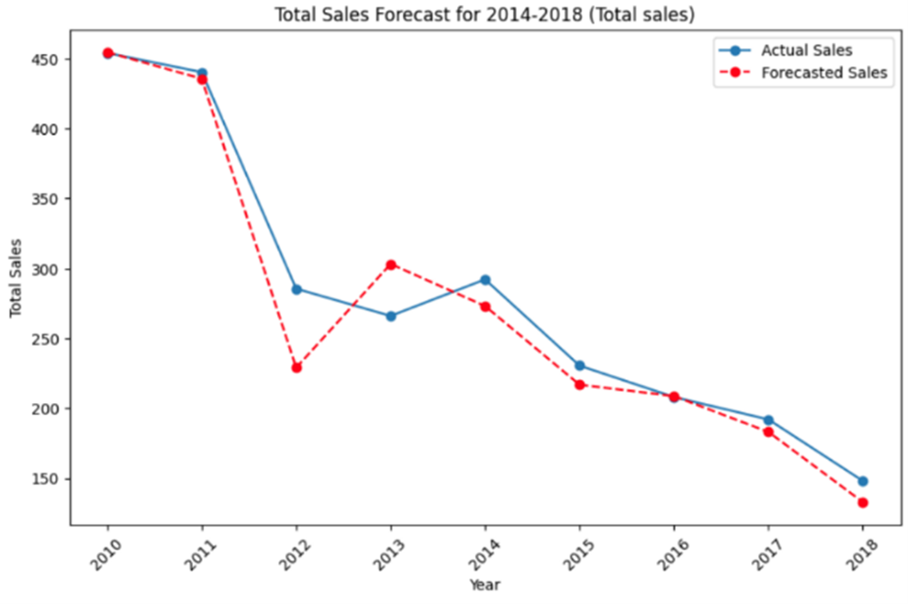

# Take a look at my amazing Data Science portfolio

## Work Experience
I have more than 4 years experience working with data. It's my favourite thing in the world. I have an immense curiosity in anything data based (get it?) and can't wait to get started on working with you.

## Education
I have completed the level 4 Data Analysis apprenticeship and have recently started the level 6 Data Science apprenticeship, which I'm really enjoying.

## Experience
I have worked within the Marketing Department of a [global process engineering company](https://www.uk.endress.com/en)  for 25 years. During this time, I've become proficient at Excel, learnt more about SAP than you've had hot dinners and dabbled with SAP Analytics Cloud. I'm finding my feet with Python and admit I've stil a long way to go!

## Interests
Amongst my many interests I enjoy gaming (especially Cricket with my son), playing cricket at a very amateurish level and cooking.

## Horizon scanning
Below is a brief summary in how I stay up-to-date on all things Data Science.

## Projects
Examples of the projects that I've completed can be found below. Take a look and find more about how I can help you.

### Project no. 1  
**Title**: An analysis of a historical video game data

  
*Figure: Global video game sales trends visualised from the dataset.*

**Introduction** 
Using Python and a freely available public data, the aim of this project was to identify trends and predict sales.

**Dataset** 
The dataset contained over 64,000 rows and had twelve columns containing things such as genre and sales. There was a large amount of data that needed rectifying - who hasn't had that problem before?

**Analysis** 
Using EDA (Exploratory Data Analysis) revealed that Sports is the highest selling genre, Activsion is the leading Publisher and the North America achieves the highest sales 
  
*Figure: Pie chart illustrating North America account for over 50% of video game sales.*

**Modelling** 
After checking the data for seasonality, I applied the ARIMA time series model to the data. I did so for the total sales provided in the data set and then did the same for each individual sales region.
  
*Figure: Pie chart illustrating North America account for over 50% of video game sales.*

**Results**
The model accurately forecast sales for Japan, which is a small market compared with North America. It struggled with total global sales due to the degree of variability in the data. Overall, it performed well and could be used to accurately predict future sales.

**Conclusions**
There is a decline in global video games sales. The North America and PAL regions account for approximately 80% of sales. Japan and Others make up the rest. Sports, Action and Shooter games generate the most revenue. Based on this analysis I would concentrate on the North American and PAL regions. I would work with publishers and developers that create the most popular games. For more niche (and role-player based) games, Japan may be a better target market. 

**Contact**
If you're interested in working together, contact me at any time chriswarren31@email.com
I look forward to hearing from you soon!

